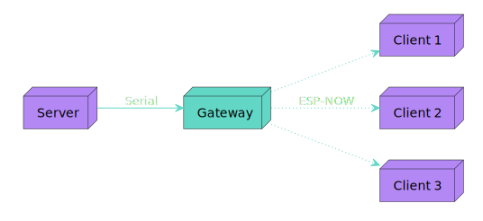

# Synesthetic Gateway

The gateway is a component of the [Synesthetic Light Organ](https://github.com/Blast12345/Synesthetic). Its job is to
facilitate communication between the server
and the clients.

## Overview

The gateway receives colors from the server over the serial port. The colors are then routed to the clients using the
ESP-NOW protocol.

The gateway is necessary because the ESP-NOW protocol is only supported on ESP devices, so the server (i.e. a computer)
cannot communicate directly with the clients.

  

### Why not Wi-Fi?

* Wi-Fi credentials must be manually updated on each client device, which is cumbersome.
* A poor connection and/or congested network can cause significant delays in the delivery of colors.
* Sending a high volume of small UDP packets congests the network, potentially causing disruptions to other devices.
* Having a dependency on Wi-Fi means the system is not as portable.

_Note: I had Wi-Fi communication implemented previously, but I could only scale to a few clients before causing issues._ 
